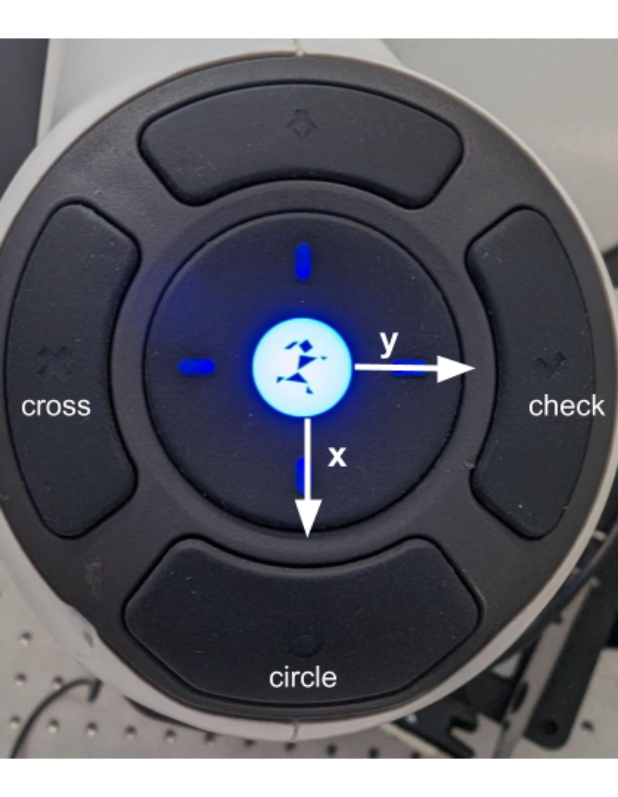

# Read franka buttons in ROS
This is a ROS repo to read the state of the buttons of franka robot.

## Installation
To install the package you need to clone the repo in your workspace and compile it with catkin build.


To read the state of the buttons of the robot, you need to run the following command:
```

roslaunch franka_buttons read_buttons.launch robot_ip:=<robot_ip> username:=<username> password:=<password>

```
where `<robot_ip>` is the ip of the robot. `<username>` and `<password>` are the username and password of the robot that you have in the Desk.

The node will publish th
e state of the buttons in the topic `/franka_buttons/x` and `/franka_buttons/y` as a `Float32` message. This topic returns 0 if not pressed 1 if pressed in postive direction and -1 if pressed in negative direction. I follow the base frame conventions. 

You can also read the state of the circle, the check and the cross buttons. The topics are `/franka_buttons/circle`, `/franka_buttons/check` and `/franka_buttons/cross`. This messages are of type `Bool`.




Have fun, and if you have any question, please let me know.

